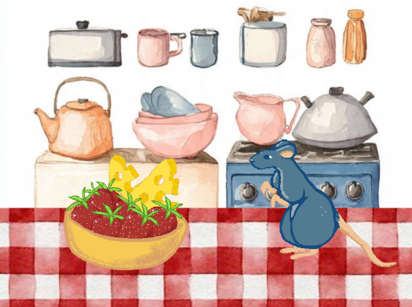
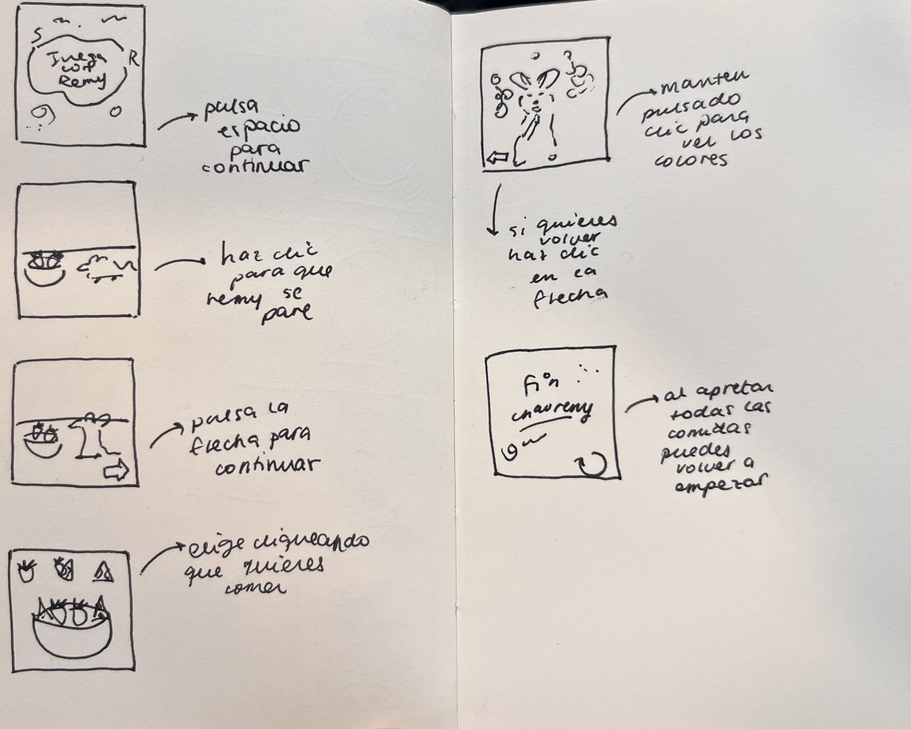

## Examen

## Link de web pública (github pages)

<https://github.com/sofiareyesantivil/Proyecto-pensamiento-computacional-s5/tree/main

### Título del proyecto

"Juega con Remy"

### Referencia de origen / bibliografía

Pelicula animada Ratatouille, año 2007, director Brad Bird.

En nuestro trabajo esta inspirado en la escena de "sabores" que esperimente Remy al comer queso y frutilla por primera vez.

### Imagen de referencia de proyecto



### Integrantes

Sofia Reyes [sofiareyesantivil](https://github.com/usuarioGithub)

Rafaela Carrasco [rafaelacarrasco-pro](https://github.com/usuarioGithub)

### Enlace de p5.js 

<https://editor.p5js.org/sofia.reyes4/sketches/v-VMQ57cg

### Relato inicial

"JUEGA CON REMY", te lleva a vivir la experienca de sabores cuando Remy come quesito y frutilla en la pelicula, al interactuar con los botones, estos te llevan a ver la magia, ejemplo al hacer click sobre la frutilla, apareceran formas de distintos tamaños del color de la frutiil, y lo mismo con hacer click en el quesito (en este aparecen de color amarillo).

### Storyboard




Al inicio pensamos en combinar dos escenas de ratatuille, la de "explosion de colores" y "remy manejando a linguini sobre su cabeza", pero finalmente nos decidimos por solo hacer la explosion de sabores

### Estados

Nuestro codigo consta de 6 estados, "PORTADA", "MESA", "TRANSICION", "MENU", "CINE", "FIN", los cuales nos van determinando que partes del skecth se estan dibujando dentro de este, al utilizar la maquina de estados, permite que el programa solo ejecute lo correspondiente a las escenas activas, asi evitamos errores en el codigo. :3

(Todos los gif y botones, portada y contra portada fueron dibujados en pixelart, en general el diseño grafico fue hecho por nosotras, por otro lado, fondo1 y fondo2, son imagenes sacadas de pinterest)

#### Estado 1 "PORTADA"

En el primer estado que vendria siendo "PORTADA", funciona al presionar "space" en el teclado, esto nos redireccina hacia el segundo estado "MESA".

Al haber acionado ya "space", este si es presionado nuevamente no se activara hasta que sea presionado el boton "reiniciar" que sale al final del juego.

```js
 case "PORTADA":
      image(portada, 0, 0, width, height);
      break;

function keyPressed() {
  if (key === " " && estadoActual === "PORTADA") {
    estadoActual = "MESA";
```


#### Estado 2 "MENÚ"

En el estado "MENÚ", existen tres botones que te redireccionan a "CINE", los botones son "frutilla", "quesito", "todito", cada uno de estos genera una gradiante de colores dependiendo del boton.

Luego cuando ya hayan sido presionados los tres botones, aparecera un cuarto boton que nos llevara a la contra portada del sketch; "FIN"

```js
case "MENU":
      image(fondo2, 0, 0, width, height);
      image(fruta2, 0, 0, width, height);

      let hoverF1 = mouseX >= 10 && mouseX <= 260 && mouseY >= 10 && mouseY <= 260;
      image(f1, 10, 10, hoverF1 ? 280 : 250, hoverF1 ? 280 : 250);

      let hoverT = mouseX >= 275 && mouseX <= 525 && mouseY >= 10 && mouseY <= 260;
      image(todito, 275, 10, hoverT ? 280 : 250, hoverT ? 280 : 250);

      let hoverQ = mouseX >= 540 && mouseX <= 790 && mouseY >= 10 && mouseY <= 260;
      image(quesito2, 540, 10, hoverQ ? 280 : 250, hoverQ ? 280 : 250);

      if (vistoFrutilla && vistoQueso && vistoTodo) {
        let tbcX = 500; 
        let tbcY = 590; 
        let tbcSize = 250;
        let hoverTBC = mouseX >= tbcX && mouseX <= tbcX + tbcSize && mouseY >= tbcY && mouseY <= tbcY + tbcSize;
        
        image(TBC, tbcX, tbcY, hoverTBC ? 280 : 250, hoverTBC ? 280 : 250);
      }
      break;

//////////

 case "MENU":
      if (mouseX >= 10 && mouseX <= 260 && mouseY >= 10 && mouseY <= 260) {}
      else if (vistoFrutilla && vistoQueso && vistoTodo) {
        let tbcX = 500; 
        let tbcY = 590; 
        let tbcSize = 250;
        if (mouseX >= tbcX && mouseX <= tbcX + tbcSize && mouseY >= tbcY && mouseY <= tbcY + tbcSize) {
          estadoActual = "FIN";
        }
      }
      break;
```

#### Estado 3 "FIN"

En este estado llegamos al final del juego, al haber presionado el boton "TBC" este nos redirecciona hacia la contra portada, activado el estado "FIN", donde aparecen los creditos y ademas un boton de reinicio, que al ser clickeado, nos lleva diretamente al iicion de todo el sketch y se reinicia el juego.

Ademas durante el juego, luego de haber presionado "space" empieza a sonar la musica, el boton "reiniciar" hace que la musica pare.

```js
 case "FIN":
      image(fin, 0, 0, width, height);
      
      let reinX = 620; 
      let reinY = 620;
      let hoverRein = mouseX >= reinX && mouseX <= reinX + tam4 && mouseY >= reinY && mouseY <= reinY + tam4;
      
      image(reiniciar, reinX, reinY, hoverRein ? 200 : tam4, hoverRein ? 200 : tam4);
      break;
////
  case "FIN":
      let reinX = 620;
      let reinY = 620;
      if (mouseX >= reinX && mouseX <= reinX + tam4 && mouseY >= reinY && mouseY <= reinY + tam4) {
        resetAnimacion();
      }
      break;
```
